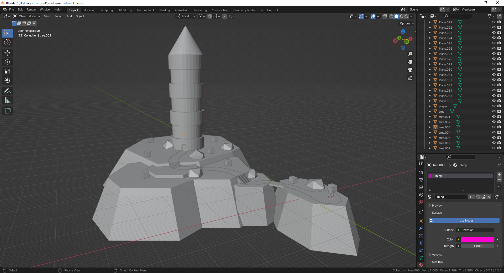

# Summary

In this project I tested out various ideas such as collision detection using the Separating Axis Theroem (SAT),
developing levels in Blender, and a new art style using retro-ish textures.

I wrote this project in Love2D, using my 3D rendering engine [g3d](https://github.com/groverburger/g3d).
This was a test I did in early 2022 to figure out to create a 3D game engine from scratch, as I had figured out the basics of 3D rendering in 2020/2021.

In particular I wanted to know the best algorithm for player/entity collision with level terrain, as well as come up with a workflow for level editing.
This problem is tricky as terrain can be tons of shapes and sizes at whatever angle it wants to be, and the collision system has to figure it out regardless!

The SAT algorithm works well in that it\'s simple to understand and code, not to mention it\'s very fast.
But that\'s not all!
Not only does it detect collisions, but it also gives you the shortest vector in order to resolve them - perfect!

Although SAT has one major Achilles\' heel: every collidable object in the level has to be convex.
This simple fact means that designing levels is a lot more challenging than I otherwise would like it to be, as I\'m not able to create any \"triangle soups\" as they\'re called in Quake fandom terminology.

Speaking of Quake, this is not the first convex-only collision algorithm so I can stand on the shoulders of giants somewhat. Either way it\'s a pain in the neck.
I found this video by raga limo super useful for creating a convex-only map with Blender: [Using Blender to make a brush-based map for Quake](https://www.youtube.com/watch?v=ymaQ6u2R8dQ).

# Some clever tricks I employed

## Editing levels in Blender, exporting as OBJ

I mostly chose to load levels from OBJ because I already had code for loading OBJ models, but this technique has some unexpectedly nice properties.

The first nice property is that the OBJ file format isn\'t just a list of vertices, UVs, and triangles.
It\'s also split into objects, with each having its own name and a material.

Therefore I can define my engine to load objects that have specially formatted names like \"player\" as spawn positions, which is very convenient.
I can also apply materials to the terrain based off the materials of that particular object in the OBJ file.

## Automatic UV mapping

Manual UV mapping sucks.
So instead I wrote some logic to automatically apply UVs based on world coordinates! I call it \"fake triplanar mapping\". Catchy, right?

I didn\'t invent this technique for this project, but it works like this (assuming a +Z up right-handed coordinate system):

-   If a triangle\'s normal is pointing up or down (the Z component is less than -0.7 or greater than +0.7), use X and Y position as UVs.
-   Otherwise, use the triangle\'s X position divided by the Y component of its normal as the U, and the Z position as the V.
-   Make sure to account for the case where the Y component of the normal vector is zero, and simply use the Y position of the triangle as the U in that scenario.

This quick and dirty approach projects walls and ceilings nicely, and works either precomputed or in a shader.
The whole process of dividing the X position by the Y normal is to make walls projected correctly at any angle, not just cardinal orientations.
Surprisingly, this technique also looks OK even when walls or ceilings are tilted a bit - you can see this in the boulders in the screenshots.

## Procedural trees

This was a technique that I developed back in 2019 or 2020.
The basic concept here is that the trunk of the tree and all of the branches are generated as Perlin worms, which simply place a billboarding circle texture every few iterations.
These Perlin worms recursively split off to form smaller branches, and the branches split off to form leaves - all of which are simply a billboarding leaves texture.

In the gif below there are a few more subtle details: like how I wrote a shader that make the trees sway in the wind, and how the leaves go from darker to lighter as they get higher in the branches.
But I still like this technique a lot as it\'s pretty simple, but can create nice looking trees.
I also like how these trees are pretty performant too.

## Stairstepping

This was one of the main reasons I decided to rethink my approach to collision detection from earlier 3d experiments I had done, such as [g3d fps](https://github.com/groverburger/g3d_fps).
In all my previous experiments, I was using a simple capsule collider algorithm that I got from [Wicked Engine\'s capsule collider devblog](https://wickedengine.net/2020/04/26/capsule-collision-detection/).

The issue with a capsule collider is it\'s difficult to detect stairs and step up them algorithmically without sliding back down, as a capsule is round.
The player collider that I\'m using with the SAT algorithm is a box, so that problem doesn\'t occur.

The way I implemented stairstepping in this experiment was kinda a hack, but I basically just biased the downwards vector when choosing which vector to resolve collision by.
In effect, this means that when the player hits a small wall low to the ground, they step up it automatically.

# Conclusions

Blender works nicely as a level editor, but building a level out of only convex shapes is extremely tedious and error prone.

The SAT algorithm for collision detection is great, but the convex-only limitation is not.
I\'ll probably use another algorithm for 3D collision in the future, but I\'ll keep this one in my back pocket.
