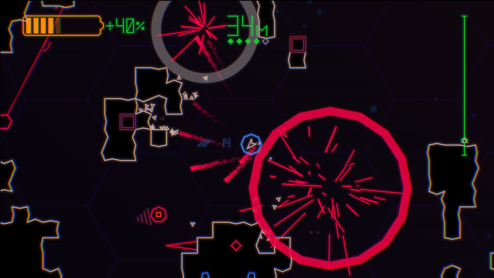
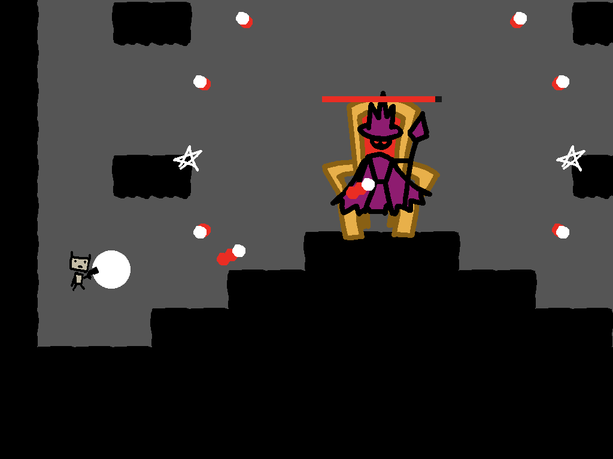
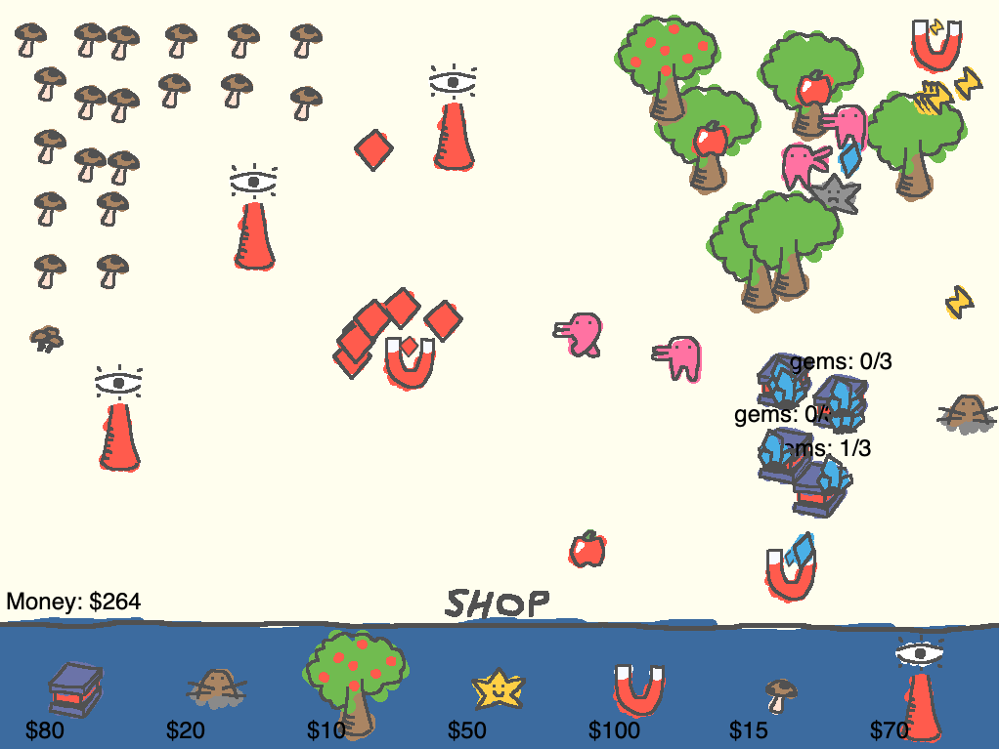
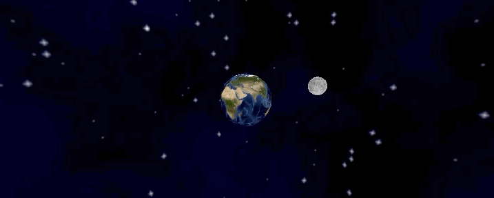
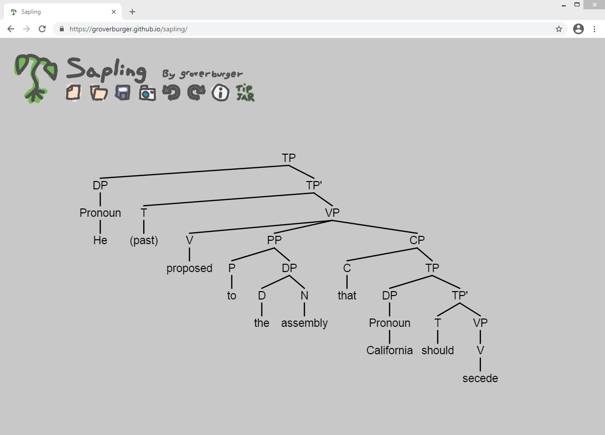

Hi I'm Grob! Thanks for checking out my website.
I like to program games and things, and occasionally write about topics I find interesting.

# Posts
- (Jan 17 2023) [3D Artstyle and Collision Testing](3d-box-collider-test.html)

# Games I've made
## Vector Prospector

My first Steam release!
It's an action roguelike, a combination of the arcade game Asteroids and Spelunky.

[Steam Page](https://store.steampowered.com/app/1145950/Vector_Prospector/)

## Into the Castle

A fast-paced action platformer I build in 48 hours for the 48th Ludum Dare game jam.

[Itch Page (Play in browser!)](https://groverburger.itch.io/into-the-castle)

## Florp Farming

A "farming" game about building your florp farming empire and buying a dog.

[Itch Page (Play in browser!)](https://groverburger.itch.io/florpfarming)

# Other things I've made
### g3d

A 3D graphics rendering engine I wrote for the [LÖVE game framework](https://love2d.org/).

[Github Repo](https://github.com/groverburger/g3d)

### Sapling

A small web app I wrote to graphically build syntax trees for my linguistics class.

[Check it out here](https://groverburger.github.io/sapling/)
